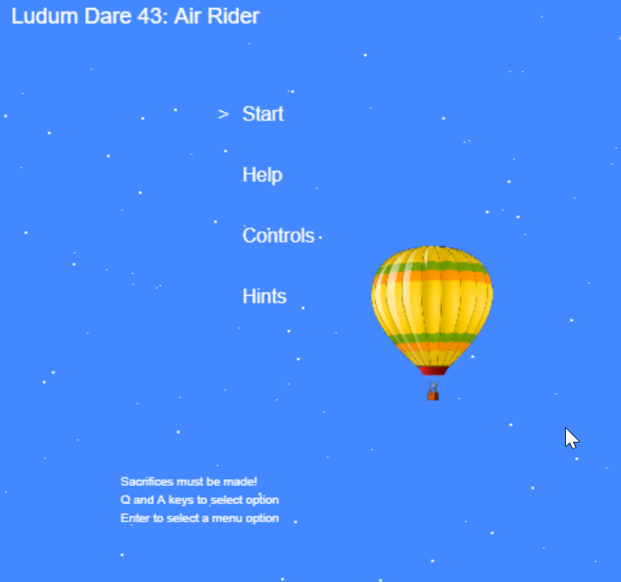
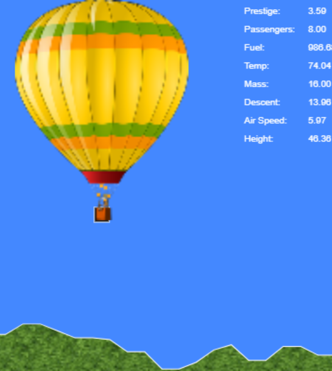

# Air Rider

This is a game made in 48 hours for Ludum Dare 43. 
The theme was "Sacrifices must be made".

https://ldjam.com/events/ludum-dare/43/air-rider.

## Game background:
Welcome to the era of balloon flight, where travel was adventurous and risky. A world where balloon pilots gained notoriety from their glorious achievements. You are a pilot in an attempt to break the distance record of a passenger flight. Gain prestige by flying a hot air balloon as far as you can and landing alive. Passengers beware, the pilot is risking everything on this venture and may sacrifice you overboard to survive. That is the risk each passenger must accept to be part of this momentous flight.

## Hosted

It is hosted here and runs as an HTML5 script and does not depend on any other library.
https://hawkie123.itch.io/air-rider

## To build
The game is written in typescript.  To run it locally:
1. download
2. npm install
3. npm build
4. navigate to dist folder and launch index.html

## In development

Polyfill to work on mobile browser
https://www.thebasement.be/working-with-babel-7-and-webpack/